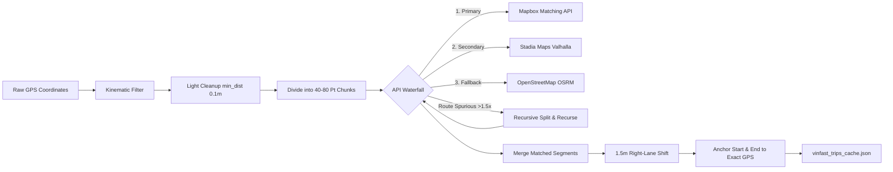

# VinFast Connected Car – Home Assistant Custom Integration
## Comprehensive Architectural & Technical Reference Manual

---

## 1. Executive Summary & Overview

### 1.1 Project Mission
The **VinFast Connected Car** integration (`custom_components/vinfast`) is a specialized, production-grade Home Assistant component developed by the open-source community (authored by `@thangnd85`). It establishes a continuous, bidirectional bridge between **Home Assistant** and **VinFast Electric Vehicles (EVs)**.

Rather than relying on conventional, laggy HTTP polling that drains the vehicle's low-voltage battery or wakes up the car unnecessarily, this integration connects directly to **VinFast's AWS IoT Core infrastructure** using **MQTT over WebSockets**. It receives real-time telemetry transmitted by the vehicle's onboard telematics box (**T-Box**) using the **OMA-LWM2M** (Open Mobile Alliance Lightweight M2M) standard.

### 1.2 Key Highlights & Innovations
- **Continuous 24/7 Telemetry without Phone App**: Connects directly to cloud brokers and simulates official mobile app handshakes to keep data streaming even when the vehicle is parked.
- **Cold Boot Recovery (State Persistence)**: Solves the vehicle "deep sleep" limitation. When Home Assistant restarts while the car is sleeping (and not broadcasting MQTT), the integration restores the vehicle's complete digital twin from localized JSON checkpoints in `/config/www/`.
- **Hybrid Map Matching & Anti-Drift GPS Engine**: Automatically sanitizes noisy raw GPS data, eliminates satellite jitter when parked, filters out GPS teleports, and uses a recursive multi-tier map matching algorithm (Mapbox $\rightarrow$ Stadia/Valhalla $\rightarrow$ OSRM) with a 1.5-meter right-lane driving offset.
- **Automated Charging Session Analytics**: Automatically detects gun connection/disconnection, calculates real-time charging power, measures grid energy consumption vs. battery capacity, calculates charging efficiency percentage, and differentiates between home AC charging and public DC fast charging.
- **Trip Lifecycle & Cost Comparison**: Automatically tracks trip starts, accumulated GPS distance, average speeds, energy consumption (kWh/100 km), and financial comparisons (electricity cost vs. equivalent gasoline cost).
- **Google Gemini Generative AI Advisor**: Integrates directly with Google Gemini models to generate real-time driver assistance in natural Vietnamese/English for extreme weather driving, sudden battery drop anomalies, and post-trip efficiency evaluations.
- **Digital Twin & Live Reverse Engineering Frontend**: Includes two custom Lovelace cards: a Digital Twin dashboard (`vinfast-digital-twin.js`) with an interactive Leaflet map, trip player, and nearby charging stations, and a live debug card (`vinfast-debug-card.js`) for capturing raw OMA-LWM2M payloads.

---

## 2. Multi-Region Cloud & Vehicle Model Support

### 2.1 Regional Endpoints (`const.py`)
VinFast operates distinct regional cloud environments for identity management, REST services, and AWS IoT brokers. The integration supports three regions via `REGION_CONFIG`:

| Parameter | Vietnam (`VN`) | North America (`US`) | Europe (`EU`) |
| :--- | :--- | :--- | :--- |
| **Auth0 Domain** | `vin3s.au.auth0.com` | `vin3s.us.auth0.com` | `vin3s.eu.auth0.com` |
| **Auth0 Client ID** | `jE5xt50qC7oIh1f32qMzA6hGznIU5mgH` | `jE5xt50qC7oIh1f32qMzA6hGznIU5mgH` | `jE5xt50qC7oIh1f32qMzA6hGznIU5mgH` |
| **REST API Base** | `https://mobile.connected-car.vinfast.vn` | `https://api.us.vinfastauto.com` | `https://api.eu.vinfastauto.com` |
| **AWS Region** | `ap-southeast-1` (Singapore) | `us-east-1` (N. Virginia) | `eu-central-1` (Frankfurt) |
| **Cognito Identity Pool**| `ap-southeast-1:c6537cdf-92dd-4b1f-99a8-9826f153142a` | `us-east-1:xxxxxx-xxxx-xxxx-xxxx` | `eu-central-1:xxxxxx-xxxx-xxxx` |
| **AWS IoT Endpoint** | `prod.iot.connected-car.vinfast.vn` | `prod.iot.us.connected-car.vinfast.vn` | `prod.iot.eu.connected-car.vinfast.vn` |

### 2.2 Supported Vehicle Models (`model_registry.py`)
The integration dynamically detects vehicle models from the user profile (`marketingName` or `dmsVehicleModel`) and attaches the appropriate hardware specifications and OMA sensor dictionaries:

| Model | Battery Capacity | WLTP/NEDC Range | Ref. Consumption | Ref. Gas Benchmark | OMA Architecture |
| :--- | :--- | :--- | :--- | :--- | :--- |
| **VF 3** | 18.64 kWh | 210 km | 0.09 kWh/km | 18.0 km/L (~5.55 L/100km) | Platform A Base (2 doors) |
| **VF 5** | 37.23 kWh | 326 km | 0.12 kWh/km | 16.5 km/L (~6.06 L/100km) | Platform A Base + 4 doors/windows |
| **VF e34** | 42.00 kWh | 285 km | 0.15 kWh/km | 14.0 km/L (~7.14 L/100km) | Platform A + 4-wheel TPMS |
| **VF 6** | 59.60 kWh | 399 km | 0.15 kWh/km | 15.3 km/L (~6.53 L/100km) | Platform A (special lock code `34206`) |
| **VF 7** | 75.30 kWh | 499 km | 0.16 kWh/km | 13.3 km/L (~7.52 L/100km) | Platform A (special lock code `34206`) |
| **VF 8** | 87.70 kWh | 471 km | 0.19 kWh/km | 11.1 km/L (~9.00 L/100km) | Platform B (Unique OMA scheme) |
| **VF 9** | 123.00 kWh | 580 km | 0.22 kWh/km | 9.5 km/L (~10.5 L/100km) | Platform B (Unique OMA scheme) |

---

## 3. High-Level System Architecture

```mermaid
flowchart TD
    subgraph VinFast Cloud & Vehicle
        TBOX[Vehicle T-Box & ECUs] -->|OMA-LWM2M Telemetry| IOT_CORE[AWS IoT Core MQTT Broker]
        AUTH0[VinFast Auth0 Identity] -->|OAuth Bearer Token| REST[VinFast Mobile Gateway REST API]
        COGNITO[AWS Cognito Identity Pool] -->|Temporary AWS Credentials| IOT_CORE
    end

    subgraph Home Assistant Core
        CF[Config Flow & Options] --> INIT[__init__.py async_setup_entry]
        INIT --> API[VinFastAPI Core Coordinator]
        API --> AUTH_MGR[AuthManager api_auth.py]
        API --> MQTT_MGR[MQTTManager api_mqtt.py]
        
        AUTH_MGR -->|1. Authenticate| AUTH0
        AUTH_MGR -->|2. Exchange Token| COGNITO
        AUTH_MGR -->|3. Attach Policy & Wakeup| REST
        AUTH_MGR -->|4. Generate SigV4 WSS URL| MQTT_MGR
        
        MQTT_MGR -->|5. Connect WSS & Ping| IOT_CORE
        IOT_CORE -->|Real-time OMA Messages| MQTT_MGR
        
        MQTT_MGR -->|Filter & Ingest| LAST_DATA[(self._last_data Dict)]
        
        API --> SENSORS[VinFastSensor Platform]
        API --> BUTTONS[VinFastButton Platform]
        API --> TRACKER[VinFastDeviceTracker]
    end

    subgraph External Services
        MQTT_MGR -->|Reverse Geocoding| OSM[OpenStreetMap Nominatim]
        MQTT_MGR -->|Weather & Temp| METEO[Open-Meteo API]
        MQTT_MGR -->|Driver Insights| GEMINI[Google Gemini AI]
        API -->|Route Map Matching| MAPS[Mapbox / Stadia / OSRM]
    end

    subgraph Local Storage & Frontend
        API -->|State JSON / Changelogs| WWW[/config/www/ Storage]
        WWW --> DT_CARD[vinfast-digital-twin.js]
        WWW --> DEBUG_CARD[vinfast-debug-card.js]
    end
```

---

## 4. Repository File Map & Responsibilities

| File Path | Lines | Primary Purpose |
| :--- | :--- | :--- |
| `manifest.json` | 13 | Component declaration, dependencies (`paho-mqtt`, `requests`), versioning (`2.1.7`). |
| `__init__.py` | 56 | Async setup entry, executor job scheduling for authentication and MQTT threads, platform forwarding. |
| `config_flow.py` | 163 | UI configuration flow, dynamic Gemini model querying, options flow handler for fuel/energy prices and API keys. |
| `const.py` | 57 | Region configuration schemas, default device identifiers, file system paths, command mappings. |
| `const_common.py` | 153 | Universal sensor definitions, virtual analytical sensors, Platform A and Platform B OMA base definitions. |
| `model_registry.py` | 23 | Vehicle model parser and router returning exact specification profiles and sensor registries. |
| `const_vf3.py` ... `const_vf9.py` | 3–35 ea. | Specific battery capacities, reference efficiencies, and model-specific sensor overrides. |
| `api.py` | 419 | Central state coordinator, analytical formulas (SOH, degradation, efficiency), JSON checkpoint storage. |
| `api_auth.py` | 381 | Auth0 login, proprietary HMAC request signatures, AWS SigV4 signed URL generation, charging REST APIs. |
| `api_mqtt.py` | 675 | Paho-MQTT WebSocket client, heartbeat keep-alives, OMA-LWM2M deserialization, trip and charging state machines. |
| `api_helpers.py` | 93 | Network helpers: Nominatim reverse geocoding, Open-Meteo weather fetcher, Google Gemini prompt caller. |
| `ai_gemini.py` | 79 | Specialized Google Gemini prompt engineering for EV driving style, battery anomalies, and weather alerts. |
| `map_matching.py` | 410 | Kinematic filtering, Haversine route geometry, recursive divide-and-conquer map matching, 1.5m lane offset. |
| `sensor.py` | 242 | Sensor entities, Vietnamese/English state formatters, truncation of large payloads into entity attributes. |
| `button.py` | 131 | Action buttons for vehicle commands (Lock, Unlock, AC, Horn, Trunk) and maintenance triggers. |
| `device_tracker.py` | 59 | GPS device tracker entity tracking vehicle location. |
| `vinfast-digital-twin.js` | 1330 | Full-featured custom Lovelace card: Leaflet map, route replaying, nearby charging stations, digital twin. |
| `vinfast-debug-card.js` | 252 | Developer debug console for capturing and inspecting incoming OMA-LWM2M codes in real-time. |
| `translations/en.json` | 28 | Configuration flow UI text and error prompts. |

---

## 5. Authentication, AWS IoT Core & Telemetry Protocols

### 5.1 Auth0 & Proprietary Request Signatures (`api_auth.py`)
Authentication follows a multi-tier authorization sequence:
1. **Auth0 Password Grant**: Exchanges user credentials for a JWT `access_token` against `https://{auth0_domain}/oauth/token` with audience set to the regional `API_BASE`.
2. **Proprietary HMAC Headers**: All VinFast REST API calls require dual HMAC-SHA256 signature headers generated using private application keys:
   - **`X-HASH`**: Generated using secret key `Vinfast@2025`:
     $$\text{X-HASH} = \text{Base64}\left(\text{HMAC-SHA256}\left(\text{"Vinfast@2025"}, [method, path, vin, secret, timestamp].join(\text{"\_"})\right)\right)$$
   - **`X-HASH-2`**: Generated using secret key `ConnectedCar@6521`:
     $$\text{X-HASH-2} = \text{Base64}\left(\text{HMAC-SHA256}\left(\text{"ConnectedCar@6521"}, [platform, vin, identifier, path, method, timestamp].join(\text{"\_"})\right)\right)$$
   - **`X-TIMESTAMP`**: Current Unix epoch in milliseconds.
3. **Auto-Recovery on Expiration**: `_post_api` automatically detects HTTP `401` or `403` status codes, re-executes `login()` to fetch a fresh token, and retries the failed request seamlessly.

### 5.2 AWS Cognito Identity & AWS SigV4 WebSocket Handshake
To connect to the AWS IoT Core MQTT message broker without an X.509 client certificate:
1. **Cognito Token Exchange**: Calls `AWSCognitoIdentityService.GetId` with the Auth0 JWT token to retrieve an `IdentityId`.
2. **Temporary Credentials**: Calls `AWSCognitoIdentityService.GetCredentialsForIdentity` to obtain temporary AWS `AccessKeyId`, `SecretKey`, and `SessionToken`.
3. **Policy Attachment**: Calls VinFast API `ccarusermgnt/api/v1/user-vehicle/attach-policy` to bind the vehicle access policy to the Cognito identity.
4. **SigV4 Presigned URL**: Constructs a presigned WebSocket URL using standard AWS Signature Version 4 for the `iotdevicegateway` service with query parameters:
   `wss://{iot_endpoint}/mqtt?X-Amz-Algorithm=AWS4-HMAC-SHA256&X-Amz-Credential=...&X-Amz-Date=...&X-Amz-Signature=...&X-Amz-Security-Token=...`

### 5.3 Vehicle Wakeup & Resource Registration
Because the car's T-Box enters low-power sleep mode when idle, the integration sends registration payloads to trigger telemetry publishing:
1. **Wakeup REST Trigger**: Calls `ccaraccessmgmt/api/v1/remote/app/wakeup`.
2. **Resource Subscription**: Sends `telemetry/app/ping` and `telemetry/{vin}/list_resource` specifying all active OMA object/instance/resource IDs.
3. **MQTT Heartbeat (Bypass)**: Every 60 seconds, `MQTTManager._send_heartbeat()` publishes an MQTT packet to `/vehicles/{vin}/push/connected/heartbeat` with payload `{"34183": {"1": {"54": "1"}}}` (or `"2"` when moving). This prevents the broker from closing the WebSocket connection and signals the T-Box that a client is actively monitoring.

---

## 6. The OMA-LWM2M Telemetry Engine

### 6.1 Telemetry Representation
VinFast transmits vehicle parameters formatted according to the **OMA-LWM2M** standard. Each telemetry item represents a triple:
$$\text{Device Key} = \text{ObjectID}\_\text{InstanceID}\_\text{ResourceID}$$
For example:
- `34183_00001_00009` $\rightarrow$ Object `34183`, Instance `1`, Resource `9` $\rightarrow$ **Battery Percentage (%)**.
- `00006_00001_00000` $\rightarrow$ Object `6` (Location), Instance `1`, Resource `0` $\rightarrow$ **Latitude (°)**.

### 6.2 Platform Differences (Platform A vs. Platform B)
VinFast architectures diverge across model generations:
- **Platform A** (`VF 3`, `VF 5`, `VF e34`, `VF 6`, `VF 7`): Uses Object `34183` for dynamic driving data, Object `34193` for charging telemetry, and Object `10351` for doors/closures.
- **Platform B** (`VF 8`, `VF 9`): Uses Object `34180` for battery/range, Object `34187` for gear position, `34188` for speed, `34199` for odometer, and Object `34190` for TPMS.

### 6.3 Comprehensive OMA-LWM2M Mapping Dictionary

#### A. Common Telemetry (All Vehicles)
| OMA Code | Entity Display Name | Unit | Type / Values | Description |
| :--- | :--- | :--- | :--- | :--- |
| `00006_00001_00000` | Vĩ độ (Latitude) | ° | Float | GPS Latitude |
| `00006_00001_00001` | Kinh độ (Longitude) | ° | Float | GPS Longitude |
| `00006_00001_00002` | Độ cao (Altitude) | m | Float | GPS Elevation above sea level |
| `00005_00001_00030` | Phiên bản Phần mềm (FRP) | — | String | Firmware Release Package version |
| `34196_00001_00004` | Phiên bản T-Box | — | String | Telematics Box firmware version |
| `34181_00001_00007` | Biển số / Tên xe phụ | — | String | Vehicle license plate or nickname |
| `34213_00001_00003` | Khóa tổng (Door Lock) | — | `1`=Locked, `0`=Unlocked | Central locking status (VF3/8/9) |
| `34206_00001_00001` | Khóa tổng / Camp Mode | — | `1`/`0` | Lock status on VF5/6/7; Camp Mode on VF3/8/9 |
| `34234_00001_00003` | Trạng thái An ninh | — | `1`/`2`=Armed, `0`=Disarmed | Anti-theft security alarm status |
| `34186_00005_00004` | Đèn nháy cảnh báo | — | `1`=On, `0`=Off | Hazard warning flashers |
| `34205_00001_00001` | Chế độ Giao xe (Valet) | — | `1`=On, `0`=Off | Valet service restricted mode |
| `34207_00001_00001` | Chế độ Thú cưng (Pet) | — | `1`=On, `0`=Off | Pet comfort mode (climate on while locked) |
| `10351_00002_00050` | Cửa tài xế | — | `0`=Closed, `1`=Open | Driver front door sensor |
| `10351_00001_00050` | Cửa phụ | — | `0`=Closed, `1`=Open | Passenger front door sensor |
| `10351_00006_00050` | Cốp sau | — | `0`=Closed, `1`=Open | Rear trunk / tailgate sensor |
| `10351_00005_00050` | Nắp Capo | — | `0`=Closed, `1`=Open | Front frunk / hood sensor |
| `34215_00002_00002` | Kính tài xế | — | `1`/`0`=Closed, `2`=Open | Driver power window position |
| `34215_00001_00002` | Kính phụ | — | `1`/`0`=Closed, `2`=Open | Passenger power window position |
| `34213_00003_00003` | Trạng thái Mô-tơ Kính | — | String | Window actuator motor state |
| `34213_00002_00003` | Trạng thái Mô-tơ Cốp | — | String | Power liftgate motor state |
| `34213_00004_00003` | Trạng thái nháy đèn pha | — | `1`=On, `0`=Off | High-beam headlight flash status |
| `34184_00001_00004` | Trạng thái điều hòa | — | `0`=Off, `1`=On | HVAC system power state |
| `34184_00001_00011` | Chế độ lấy gió | — | `0`=Fresh, `1`=Recirc | HVAC intake flap mode |
| `34184_00001_00012` | Hướng gió điều hòa | — | `1`=Face, `2`=Face/Floor, `3`=Floor, `4`=Defrost/Floor | Air distribution vent mode |
| `34184_00001_00009` | Sấy kính | — | `0`=Off, `1`=On | Front windshield defroster |
| `34184_00001_00025` | Mức quạt gió | Mức | Integer (1–8) | Blower fan speed level |
| `34184_00001_00041` | Mức độ làm lạnh | Mức | Integer | A/C compressor cooling intensity |

#### B. Rear Doors & Windows (4-Door Models)
| OMA Code | Entity Display Name | Unit | Type / Values | Description |
| :--- | :--- | :--- | :--- | :--- |
| `10351_00004_00050` | Cửa sau tài xế | — | `0`=Closed, `1`=Open | Rear left door |
| `10351_00003_00050` | Cửa sau phụ | — | `0`=Closed, `1`=Open | Rear right door |
| `34215_00004_00002` | Kính sau tài xế | — | `1`/`0`=Closed, `2`=Open | Rear left power window |
| `34215_00003_00002` | Kính sau phụ | — | `1`/`0`=Closed, `2`=Open | Rear right power window |

#### C. Platform A Specifics (`VF3`, `VF5`, `VFe34`, `VF6`, `VF7`)
| OMA Code | Entity Display Name | Unit | Description |
| :--- | :--- | :--- | :--- |
| `34183_00001_00009` | Phần trăm Pin | % | Main High-Voltage Traction Battery SoC |
| `34183_00001_00011` | Quãng đường dự kiến | km | Estimated remaining driving range |
| `34183_00001_00001` | Vị trí cần số | — | Gear Position (`1`=P, `2`=R, `3`=N, `4`=D) |
| `34183_00001_00002` | Tốc độ hiện tại | km/h | Vehicle speed |
| `34183_00001_00003` | Tổng ODO | km | Cumulative odometer reading |
| `34183_00001_00010` | Trạng thái Lái (Ready) | — | Drive readiness (`2`=Not Ready, `3`=Ready to Drive) |
| `34183_00001_00029` | Phanh tay điện tử | — | Electronic Parking Brake (`0`=Released, `1`=Engaged) |
| `34183_00001_00035` | Công tắc Phanh chân | — | Brake pedal depression switch |
| `34183_00001_00005` | Pin 12V (Ắc quy) | % | Auxiliary 12V lead-acid / LFP battery SoC |
| `34220_00001_00001` | Sức khỏe pin (SOH) | % | Battery State Of Health from BMS |
| `34193_00001_00031` | Cắm súng sạc (Plug) | — | Charge port physical connection (`1`=Plugged, `0`=Unplugged) |
| `34193_00001_00005` | Trạng thái sạc | — | Charge state (`1`=Charging, `2`=Completed, `0`/`3`/`4`=Idle) |
| `34193_00001_00007` | Thời gian sạc còn lại | min | Minutes until target charge reached |
| `34193_00001_00026` | Thời gian sạc ước tính | min | Estimated duration to full charge |
| `34193_00001_00013` | Giờ hoàn tất sạc dự kiến | — | Target completion timestamp |
| `34193_00001_00032` | Relay hệ thống sạc | — | High-voltage charging contactor relay |
| `34193_00001_00016` | Mã phiên sạc (Session ID) | — | Active charging session identifier |
| `34183_00001_00007` | Nhiệt độ ngoài trời | °C | Ambient outdoor temperature sensor |
| `34183_00001_00015` | Nhiệt độ trong xe | °C | Cabin interior temperature sensor |
| `34224_00001_00005` | Nhiệt độ điều hòa cài đặt | °C | HVAC target setpoint temperature |
| `34193_00001_00019` | Mục tiêu sạc (Target) | % | Target SoC limit (**VF 3**) |
| `34193_00001_00014` | Mục tiêu sạc (Target) | % | Target SoC limit (**VF 5**) |
| `34183_00001_00016`–`19` | Áp suất lốp (FL, FR, RL, RR)| bar | Tire Pressure Monitoring (**e34**, **VF6**, **VF7**) |

#### D. Platform B Specifics (`VF8`, `VF9`)
| OMA Code | Entity Display Name | Unit | Description |
| :--- | :--- | :--- | :--- |
| `34180_00001_00011` | Phần trăm Pin | % | Main Traction Battery SoC |
| `34180_00001_00007` | Quãng đường dự kiến | km | Estimated driving range |
| `34180_00001_00010` | Tên định danh xe (MQTT) | — | Telemetry vehicle name / drive state |
| `34187_00000_00000` | Vị trí cần số | — | Gear Position (`1`=P, `2`=R, `3`=N, `4`=D) |
| `34188_00000_00000` | Tốc độ hiện tại | km/h | Vehicle speed |
| `34199_00000_00000` | Tổng ODO | km | Cumulative odometer reading |
| `34183_00000_00001` | Trạng thái sạc | — | Charge state (`1`=Charging, `2`=Completed, `0`=Idle) |
| `34183_00000_00004` | Thời gian sạc còn lại | min | Minutes remaining to complete charge |
| `34183_00000_00012` | Công suất sạc | kW | Live charging power |
| `34183_00000_00015` | Điện áp sạc | V | High-voltage charging voltage |
| `34183_00000_00016` | Dòng điện sạc | A | High-voltage charging current |
| `34193_00001_00012` | Mục tiêu sạc (Target) | % | Target SoC charge limit |
| `34190_00000_00001` | Áp suất lốp Trước Trái | bar | Front Left Tire Pressure |
| `34190_00001_00001` | Áp suất lốp Trước Phải | bar | Front Right Tire Pressure |
| `34190_00002_00001` | Áp suất lốp Sau Trái | bar | Rear Left Tire Pressure |
| `34190_00003_00001` | Áp suất lốp Sau Phải | bar | Rear Right Tire Pressure |

#### E. Virtual Analytical Sensors (`VIRTUAL_SENSORS`)
These sensors do not map to a single raw OMA code; they are computed dynamically by the internal data science engine:
| Sensor Key | Entity Display Name | Unit | Computation Formula / Logic |
| :--- | :--- | :--- | :--- |
| `api_vehicle_status` | Trạng thái hoạt động | — | Evaluates gear, motion state, and charging state ("Đang di chuyển", "Đang đỗ", "Đang sạc", etc.) |
| `api_current_address` | Vị trí xe (Địa chỉ) | — | Reverse geocoded human address from OpenStreetMap Nominatim with 3-decimal grid caching |
| `api_trip_distance` | Quãng đường chuyến đi | km | Accumulated distance calculated using Haversine formula across valid GPS points |
| `api_trip_avg_speed` | Tốc độ TB chuyến đi | km/h | $\text{Trip Distance} / \text{Trip Duration (hours)}$ |
| `api_trip_energy_used`| Điện năng tiêu thụ Trip | kWh | $\frac{\Delta\text{SoC}}{100} \times \text{Battery Capacity (kWh)}$ |
| `api_trip_efficiency` | Hiệu suất tiêu thụ Trip | kWh/100km | $\frac{\text{Trip Energy (kWh)}}{\text{Trip Distance (km)}} \times 100$ |
| `api_static_capacity` | Dung lượng pin thiết kế | kWh | Factory rated gross/usable battery capacity from model profile |
| `api_static_range` | Quãng đường công bố | km | Factory rated standard range from model profile |
| `api_soh_calculated` | Sức khỏe pin (SOH) | % | Verified real-world capacity vs. nominal capacity: $\frac{\text{Charged kWh} \times 0.92}{\Delta\text{SoC} / 100} / \text{Cap} \times 100$ |
| `api_battery_degradation`| Độ chai pin (Theo SOH)| kWh | Capacity loss calculated from SOH degradation |
| `api_est_range_degradation`| Khả năng chai pin (Range)| % | Estimated range loss based on lifetime average consumption vs. factory rating |
| `api_lifetime_efficiency`| Hiệu suất TB xe | kWh/100km | $\frac{\text{Total Lifetime Energy Charged (kWh)}}{\text{Odometer (km)}} \times 100$ |
| `api_calc_max_range` | Quãng đường thực tế 100%| km | Realistic driving range on a 100% charge based on actual driving consumption |
| `api_calc_remain_range` | Quãng đường còn lại | km | Estimated range remaining based on dynamic consumption: $\text{km per 1\%} \times \text{Current SoC}$ |
| `api_calc_range_per_percent`| Quãng đường / 1% pin | km | Measured distance traveled per 1% SoC drop during ongoing driving |
| `api_live_charge_power`| Công suất sạc live | kW | Measured from session API or calculated via: $\frac{\Delta\text{SoC} / 100 \times \text{Capacity}}{\Delta\text{Time (hours)}}$ |
| `api_last_charge_efficiency`| Hiệu suất sạc thực tế | % | $\frac{\text{Energy Added to Battery}}{\text{Energy Billed by Charging Station}} \times 100$ |
| `api_total_charge_cost_est`| Tổng chi phí sạc quy đổi| VNĐ | $\text{Total Lifetime Energy Charged} \times \text{Cost per kWh}$ |
| `api_trip_charge_cost`| Chi phí sạc chuyến đi | VNĐ | $\text{Trip Energy Used} \times \text{Cost per kWh}$ |
| `api_total_gas_cost` | Tổng chi phí xăng tương đương| VNĐ | $\frac{\text{Total Odometer}}{\text{Gas km/L}} \times \text{Gasoline Price per Liter}$ |
| `api_trip_gas_cost` | Chi phí xăng chuyến đi | VNĐ | $\frac{\text{Trip Distance}}{\text{Gas km/L}} \times \text{Gasoline Price per Liter}$ |
| `api_total_charge_sessions`| Tổng số lần sạc | lần | Public charging sessions + Home charging sessions |
| `api_public_charge_sessions`| Số lần sạc tại trạm | lần | Count of completed charging sessions retrieved from VinFast charging history API |
| `api_home_charge_sessions`| Số lần sạc tại nhà | lần | Count of sessions terminated when distant from any public charging station or power $\le 11$ kW |
| `api_home_charge_kwh` | Điện năng sạc tại nhà | kWh | Cumulative energy charged during home AC sessions |
| `api_total_energy_charged`| Tổng điện năng đã sạc | kWh | Cumulative lifetime energy (Public + Home) |
| `api_ai_advisor` | Cố vấn Xe điện AI | — | Contextual natural language advisory text from Google Gemini |
| `api_security_warning`| Cảnh báo An ninh | — | Combined warning message: doors open, windows open, car unlocked while parked |
| `api_debug_raw` | System Debug Raw | — | Count and timestamp of latest MQTT batch; full dictionary stored in entity attributes |

---

## 7. Data Science & Telemetry Subsystems

### 7.1 Smart Charging Lifecycle
The charging subsystem in `api_mqtt.py` manages a state machine that handles both public DC fast chargers and home AC chargers:
1. **Plug-In & Session Initialization**:
   - Triggered when `34193_00001_00005` or `34183_00000_00001` changes to `1` (Charging).
   - Records starting SoC (`api_last_charge_start_soc`) and timestamp.
   - Immediately spawns an asynchronous thread to call `fetch_active_charging_session()`, querying `ccarcharging/api/v1/charging-sessions/active` to obtain the station's reported charging power (`chargingPower`) and target battery limit (`targetBatteryLevel`).
2. **Real-time Power Calculation**:
   - If the station does not report power, the integration computes differential charging power dynamically:
     $$P_{\text{live}} (\text{kW}) = \frac{(\text{SoC}_t - \text{SoC}_{t-\Delta t}) \times \text{Battery Capacity (kWh)}}{100 \times \Delta t (\text{hours})}$$
   - Filters out spikes exceeding 360 kW.
3. **Session Completion & Home vs. Public Detection**:
   - When charging ends, the integration calculates session duration and total energy added:
     $$E_{\text{added}} (\text{kWh}) = \frac{\Delta\text{SoC}}{100} \times \text{Capacity}$$
   - Evaluates whether the session occurred at home or at a public station:
     - Checks proximity to known stations via `api_nearby_stations`. If distance to the nearest station $> 500$ meters, or if maximum power was $\le 11$ kW, it is classified as **Home AC Charging**.
     - Otherwise, it is marked as a **VinFast Public Charging Station**.
   - Immediately writes a provisional charging receipt to `/config/www/vinfast_charge_history_{vin}.json`.
4. **Automated Bill Verification**:
   - Spawns a background thread that polls `fetch_charging_history()` with exponential backoff (up to 6 attempts over 3 minutes) to retrieve the official invoice from VinFast's charging backend (`ccarcharging/api/v1/charging-sessions/search`).
   - Reconciles billed kWh from the grid against theoretical energy received to determine actual charging efficiency ($\eta_{\text{charge}}$).

### 7.2 Trip Management & Profiling
1. **Trip Lifecycle**:
   - A trip starts automatically when the vehicle shifts into `D` (Drive) or `R` (Reverse), or when speed $> 0$.
   - The trip remains active while the vehicle is driving or temporarily stopped (e.g., at traffic lights).
   - If the vehicle is parked (`P`) and stationary for **300 seconds (5 minutes)**, the trip is automatically finalized.
2. **Plausibility & Anti-Glitch Telemetry**:
   - To prevent GPS teleports or satellite jumps from corrupting trip distances, every incoming GPS coordinate is validated:
     $$\text{Implied Speed} = \frac{\text{Haversine Distance}}{\Delta t} \times 3.6$$
   - If implied speed $> 180$ km/h, the point is dropped.
   - If reported vehicle speed $= 0$ but GPS distance $> 30$ meters, the point is rejected as satellite drift.
3. **Trip Closure & Cost Ledger**:
   - Finalizes trip distance, trip average speed, and energy consumed.
   - Computes trip electricity cost:
     $$\text{Cost}_{\text{EV}} = E_{\text{trip}} \times \text{cost\_per\_kwh}$$
   - Computes equivalent gasoline cost for the same distance:
     $$\text{Cost}_{\text{Gas}} = \frac{\text{Distance}}{\text{gas\_km\_per\_liter}} \times \text{gas\_price}$$
   - Saves trip metadata and coordinates to `/config/www/vinfast_trips_{vin}.json` and initiates background map matching.

### 7.3 Hybrid Map-Matching Engine (`map_matching.py`)
Raw GPS traces often wander off roads due to urban canyons and poor satellite reception. The map matching subsystem runs an automated pipeline:



1. **Kinematic Glitch Filter**: Validates physical acceleration:
   $$d_{\text{max}} = \left(\frac{\max(v_1, v_2)}{3.6} \times \Delta t\right) + 150.0\text{ m}$$
   Any jump exceeding $d_{\text{max}}$ and $> 300$ meters is stripped.
2. **Recursive Divide-and-Conquer**:
   If an API rejects a noisy chunk or returns a circuitous detour where matched length exceeds raw length by $> 1.5\times$ ($d_{\text{matched}} > 1.5 \times d_{\text{raw}}$), the segment is split into two halves and recursed independently.
3. **Right-Lane Traffic Offset (`offset_route_right`)**:
   Road centerlines in navigation maps lie in the middle of the roadway. To accurately represent real-world driving on right-hand traffic roads (Vietnam, US, EU), every coordinate is translated 1.5 meters perpendicular to its heading vector:
   $$\theta_{\text{right}} = \text{atan2}(dy, dx) - \frac{\pi}{2}$$
   $$\text{Lat}_{\text{offset}} = \frac{1.5}{111320} \sin(\theta_{\text{right}}), \quad \text{Lon}_{\text{offset}} = \frac{1.5}{111320 \cos(\text{Lat})} \cos(\theta_{\text{right}})$$
4. **Boundary Anchor**: The initial and final coordinates are locked to the vehicle's exact physical parking locations.

### 7.4 Google Gemini AI Advisor (`ai_gemini.py`)
The AI engine provides contextual driver insights using Google's Gemini models (`gemini-2.5-flash`, `gemini-2.5-pro`, etc.):
- **Weather Mode**: Triggered when severe weather conditions (extreme heat $\ge 35^\circ$C, cold $\le 15^\circ$C, heavy rain, fog, storms) are reported by Open-Meteo. Generates actionable advice under 40 words for climate control and driving safety.
- **Anomaly Mode**: Triggered when consumption during driving drops below 70% of standard expectations ($\text{km per 1\%} < 0.70 \times \text{standard}$). Explains whether high speed, headwinds, or excessive HVAC draw caused the drop.
- **Trip Mode**: Evaluates completed trips, scoring efficiency against factory specifications and offering driving tips in under 50 words.

---

## 8. Entity Architecture & Home Assistant Integration

### 8.1 Naming & Identifier Scheme
To prevent entity collisions in multi-car garages, all entity IDs and unique IDs are strictly standardized:
- **Entity ID Pattern**:
  `sensor.{model_slug}_{vin_slug}_{slugified_name}`
  *(e.g., `sensor.vf8_abcd1234_phan_tram_pin`)*
- **Unique ID Pattern**:
  `{model_slug}_{vin_slug}_{device_key}`
  *(e.g., `vf8_abcd1234_34180_00001_00011`)*
- **Device Info Association**:
  All sensors, buttons, and trackers share a single Home Assistant Device Entry identified by `{(DOMAIN, vin)}` with manufacturer `"VinFast"` and model set to the vehicle's marketing name.

### 8.2 Buttons & Remote Controls (`button.py`)
`button.py` creates actionable controls divided into three categories:
1. **Local Action Buttons**:
   - `button.{model}_{vin}_tim_tram_sac`: Queries nearby public charging stations and updates attributes.
2. **Maintenance & AI Optimization Buttons**:
   - `button.{model}_{vin}_fix_map`: Triggers `async_fix_all_historical_trips(force=True)`, re-running the hybrid map matching engine across all cached trips.
3. **Vehicle Remote Commands (`ccaraccessmgmt/api/v2/remote/app/command`)**:
   - `1`: Khóa cửa (Lock Doors)
   - `2`: Mở cửa (Unlock Doors)
   - `3`: Bấm còi (Honk Horn)
   - `4`: Nháy đèn (Flash Headlights)
   - `5`: Bật điều hòa (Turn On Climate)
   - `6`: Tắt điều hòa (Turn Off Climate)
   - `7`: Mở cốp (Open Power Liftgate)
   - `8` to `20`: Reserved Raw Commands for testing undocumented commands.

### 8.3 Important Observation on `device_tracker.py`
The codebase includes a fully implemented GPS device tracker entity class in `device_tracker.py` (`VinFastDeviceTracker`). However, in `custom_components/vinfast/__init__.py`, the platform array is currently defined as:
```python
PLATFORMS = ["sensor", "button"]
```
Because `"device_tracker"` is not in `PLATFORMS`, Home Assistant does not forward entry setup to `device_tracker.py` during initialization. Adding `"device_tracker"` to `PLATFORMS` enables `device_tracker.{model}_{vin}_vi_tri_gps` natively.

### 8.4 State Persistence & Cold Boot Architecture
Because vehicle telematics boxes enter sleep mode when parked, restarting Home Assistant could result in `unavailable` or `unknown` entity states. The integration solves this via localized state persistence:
- **State File**: `/config/www/vinfast_state_{vin}.json`
  - Saves the entire `_last_data` dictionary and internal calculation memory every 60 seconds and at critical state transitions.
  - On startup (`async_setup_entry` $\rightarrow$ `_load_state()`), all entity values, trip accumulators, and charging states are reloaded into memory before the first MQTT packet arrives.
- **Changelog File**: `/config/www/vinfast_changelog_{vin}.json`
  - Records a rolling buffer of the last 100 raw OMA parameter value transitions with timestamps.
- **Trip Ledger**: `/config/www/vinfast_trips_{vin}.json`
  - Stores historical trips with route coordinates, start/end addresses, durations, and smoothed statuses.

---

## 9. Frontend Ecosystem: Digital Twin & Debug Cards

### 9.1 Digital Twin Card (`vinfast-digital-twin.js`)
A custom Lovelace card (~1330 lines) providing a visual control dashboard:
- **Interactive Leaflet Map**: Displays vehicle position, dynamic orientation arrow aligned with travel heading, and live speed badge.
- **Trip Selector & Playback**: Replays completed trips with path animation, speed variations, and start/stop markers.
- **Smart Station Suggestion**: If battery $< 30\%$, searches valid nearby stations along the vehicle's heading (filtering for $\ge 20$ kW DC fast chargers for VF3) and provides a one-click Google Maps driving navigation button.
- **Charging Station Markers**: Color-coded pins indicating charger occupancy:
  - 🟢 Green: Plentiful ($> 80\%$ available)
  - 🔵 Blue: Moderate ($50\%–80\%$)
  - 🟡 Yellow: Busy ($30\%–50\%$)
  - 🟠 Orange: Nearly full ($< 30\%$)
  - 🔴 Red: Fully occupied ($0$ available)
- **Kinematic Efficiency Chart**: Renders dynamic horizontal bar charts comparing consumption efficiency across speed bands (e.g., $0–30$ km/h, $30–60$ km/h, $60–90$ km/h).

### 9.2 Real-time Debug Console Card (`vinfast-debug-card.js`)
Designed for community reverse-engineering:
- Directly fetches `/local/vinfast_changelog_{vin}.json` and `/local/vinfast_state_{vin}.json`.
- Features an instant search filter to isolate specific OMA codes (e.g., searching `34213` to observe lock state changes).
- Displays dual tabs: **Changelog** (chronological event history) and **Raw JSON** (entire dictionary of received codes).

---

## 10. Vietnamese Terminology & Bilingual Glossary

Because VinFast is a Vietnamese manufacturer, much of the internal documentation, code comments, and sensor names use Vietnamese automotive terms. The table below provides a full cross-reference:

| Vietnamese Term | English Equivalent | Context in Integration |
| :--- | :--- | :--- |
| **Tích hợp** | Integration | Custom component for Home Assistant |
| **Cảm biến** | Sensor | Home Assistant sensor entity |
| **Thực thể** | Entity | Home Assistant entity (`sensor.*`, `button.*`) |
| **Khóa tổng** | Central Lock | Central door lock status (all doors) |
| **Cửa tài xế / Cửa phụ** | Driver Door / Passenger Door | Front left and front right doors |
| **Cửa sau tài / Cửa sau phụ** | Rear Driver / Rear Passenger Door| Rear left and rear right doors |
| **Cốp sau / Nắp Capo** | Trunk (Tailgate) / Frunk (Hood) | Rear cargo door and front motor hood |
| **Kính tài / Kính phụ** | Driver Window / Passenger Window | Front left / front right power windows |
| **Kéo phanh tay / Nhả phanh tay**| Parking Brake Engaged / Released| EPB (Electronic Parking Brake) state |
| **Sẵn sàng chạy (Ready)** | Ready to Drive | High-voltage powertrain active and drive-ready |
| **Vị trí cần số** | Gear Selector Position | Transmission selector mode (`P`, `R`, `N`, `D`) |
| **Cắm súng sạc (Plug)** | Charge Gun Plugged | EVSE connector physically plugged into charge port |
| **Trạng thái sạc** | Charging Status | Battery charging state (Charging, Full, Idle) |
| **Độ chai pin** | Battery Degradation | Loss of usable battery capacity over time (kWh or %) |
| **Sức khỏe pin (SOH)** | State of Health (SOH) | Percentage of original battery capacity remaining |
| **Dung lượng pin thiết kế** | Nominal / Design Capacity | Original factory-rated battery capacity (kWh) |
| **Quãng đường dự kiến** | Estimated Range | Remaining driving distance estimate |
| **Dải tốc độ tối ưu nhất** | Optimal Speed Range | Speed interval that achieves lowest energy consumption per km |
| **Nắn đường (Map Matching)** | Map Matching | Snapping noisy GPS coordinates to road networks |
| **Cố vấn Xe điện AI** | EV AI Advisor | Google Gemini automated driver advisory feature |
| **Lấy gió trong / Lấy gió ngoài**| Recirculation / Fresh Air | Climate control air intake flap mode |
| **Sấy kính lái** | Windshield Defroster | Front glass heating and dehumidifying |
| **Chế độ Giao xe (Valet)** | Valet Mode | Mode restricting vehicle settings when handing to valet |
| **Chế độ Cắm trại (Camp)** | Camp Mode | Keeps climate and entertainment on while parked |
| **Chế độ Thú cưng (Pet)** | Pet Mode | Keeps climate on while parked and vehicle is locked |
| **Quy đổi xăng** | Gasoline Equivalent | Comparing electric consumption costs with petrol vehicles |
| **Trạm sạc lân cận** | Nearby Charging Stations | Geographically nearest EV charging stations |

---

## 11. Configuration, Options & Setup Guide

### 11.1 Installation via HACS
1. Open Home Assistant $\rightarrow$ Navigate to **HACS** $\rightarrow$ **Integrations**.
2. Click the top-right menu $\rightarrow$ Select **Custom repositories**.
3. Add Repository URL: `https://github.com/thangnd85/vinfast-connected-car` with Category **Integration**.
4. Click **Download**, then restart Home Assistant.

### 11.2 Configuration Flow (`config_flow.py`)
1. In Home Assistant, go to **Settings** $\rightarrow$ **Devices & Services** $\rightarrow$ **Add Integration**.
2. Search for **VinFast** and fill out the configuration dialog:
   - **Email & Password**: VinFast mobile app account credentials.
   - **Region**: Select `VN` (Vietnam), `US` (United States), or `EU` (Europe).
   - **Language**: Select `vi` (Vietnamese) or `en` (English).
   - **Google Gemini API Key** *(Optional)*: For AI advisor features.
   - **Mapbox / Stadia API Tokens** *(Optional)*: For high-accuracy map matching.
3. If a Gemini API key is supplied, step 2 dynamically queries available models from Google and prompts for model selection (`gemini-2.5-flash`, `gemini-2.5-pro`, etc.).

### 11.3 Options Flow Configuration
Clicking **Configure** on an existing VinFast integration entry allows adjusting runtime parameters without re-authenticating:
- **Cost per kWh (`cost_per_kwh`)**: Electricity rate for cost calculations (default: `4,000` VNĐ/kWh).
- **Gasoline Price (`gas_price`)**: Fuel price for comparison calculations (default: `20,000` VNĐ/Liter).
- **Reference EV Consumption (`ev_kwh_per_km`)**: Overrides vehicle default kWh/km consumption.
- **Reference Gas Consumption (`gas_km_per_liter`)**: Overrides benchmark petrol km/L.
- **Gemini Model & Map Tokens**: Update API keys or switch AI models dynamically.

---

## 12. Reverse Engineering Guide for Contributors

For contributors analyzing unmapped telemetry codes from new vehicle models or firmware updates:
1. **Enable Debug Card**: Add `vinfast-debug-card.js` to your Lovelace dashboard, pointing to your vehicle's `api_debug_raw` sensor.
2. **Observe Real-time Transitions**: Change vehicle states (e.g., turn on seat heaters, change ambient lighting, adjust drive modes) and observe newly appearing keys in the **Changelog** tab.
3. **Inspect Raw Code Stream**: Open Home Assistant **Developer Tools** $\rightarrow$ **States** $\rightarrow$ Search `sensor.[model]_[vin]_system_debug_raw`. The `extra_state_attributes` contains every raw key-value pair received over MQTT.
4. **Registering a New Sensor**:
   - Open `custom_components/vinfast/const_common.py` (or the specific `const_vf*.py` file).
   - Add the new key using the standard tuple definition:
     ```python
     "OBJECT_INSTANCE_RESOURCE": ("Tên Cảm Biến", "Đơn vị", "mdi:icon", "device_class")
     ```
   - If the raw numeric value requires string translation (e.g., converting `0`/`1` to descriptive text), add a mapping case in `sensor.py` inside `_process_update()`.
5. **Submit a Pull Request**: Share the newly decoded parameter with the community on GitHub!
